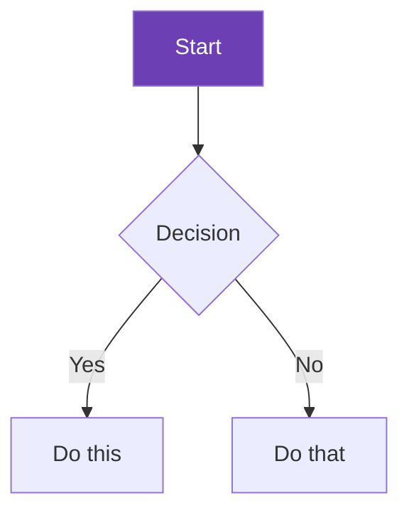
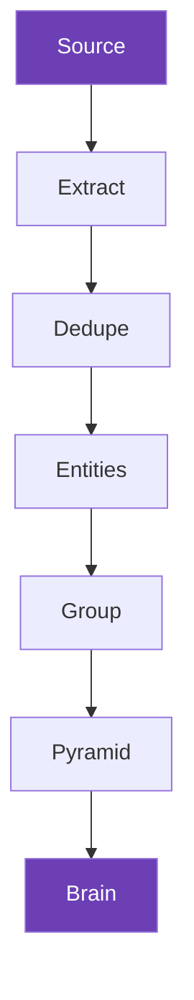
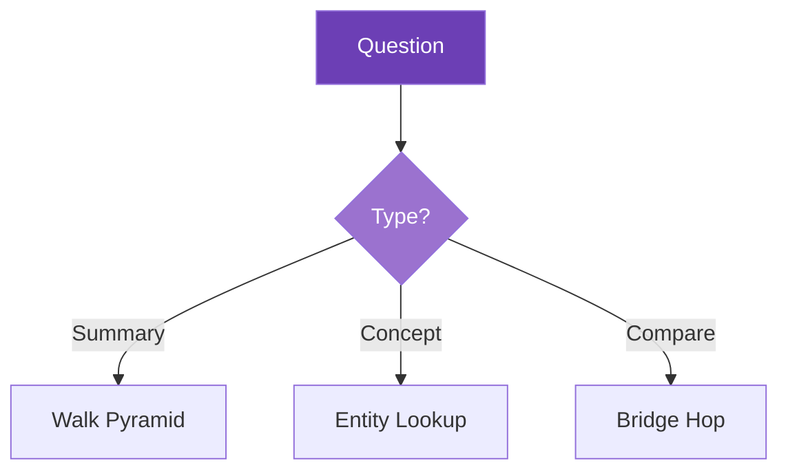
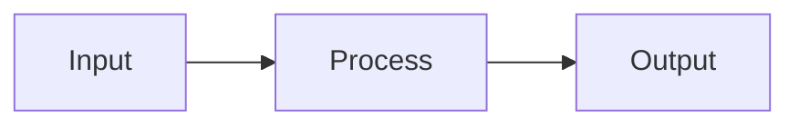

# Quartz Rendering Capabilities

When writing content for docs or brain pages, these features render natively.

## Callouts (Obsidian syntax)

```markdown
> [!tip] Title
> Content inside the callout.

> [!warning] Watch out
> This is important.
```

Available types:

| Type | Color | Use for |
|---|---|---|
| `[!note]` | Blue | General information |
| `[!tip]` | Green | Best practices, recommendations |
| `[!warning]` | Orange | Potential issues |
| `[!danger]` | Red | Critical warnings |
| `[!info]` | Blue | Contextual information |
| `[!example]` | Purple | Code examples, usage patterns |
| `[!quote]` | Gray | Quotations |
| `[!question]` | Yellow | FAQs, open questions |
| `[!success]` | Green | Confirmed results |
| `[!failure]` | Red | Known issues |
| `[!bug]` | Red | Bugs |
| `[!abstract]` | Teal | Summaries, TLDRs |

Callouts can be collapsible with `+` or `-`:
```markdown
> [!tip]+ Expandable (open by default)
> Content

> [!tip]- Collapsed by default
> Hidden content
```

## Mermaid diagrams

````markdown

````

Supported diagram types:

| Type | Syntax | Best for |
|---|---|---|
| Flowchart | `graph TD` / `graph LR` | Pipelines, processes |
| Sequence | `sequenceDiagram` | Agent interactions, API flows |
| Class | `classDiagram` | Architecture, data models |
| State | `stateDiagram-v2` | Workflows, state machines |
| Gantt | `gantt` | Timelines |
| Pie | `pie` | Distributions |
| Mindmap | `mindmap` | Concept trees |

### Pipeline example
````markdown

````

### Navigation strategy example
````markdown

````

## Wikilinks

```markdown
[[Page Title]]           — links to another page
[[Page Title|Display]]   — custom display text
```

Wikilinks resolve across the entire vault. Quartz renders them as clickable links and shows backlinks on every page.

## Code blocks with syntax highlighting

````markdown
```python
from distillary.vault_ops import fix_vault
fix_vault("tmp", "brain/sources/lean-startup")
```

```bash
git clone https://github.com/distillary/distillary.git
```

```yaml
tags:
  - type/claim/atom
  - priority/core
kind: claim
```

```json
{
  "sources": [{"title": "The Lean Startup", "claims": 302}]
}
```
````

Supported languages: python, bash, yaml, json, javascript, typescript, markdown, html, css, sql, and many more.

## Tables

```markdown
| Column A | Column B | Column C |
|---|---|---|
| data | data | data |
```

## LaTeX math

```markdown
Inline: $E = mc^2$

Block:
$$
\sum_{i=1}^{n} x_i = x_1 + x_2 + \cdots + x_n
$$
```

## Embeds

```markdown
![[Other Page]]          — embed another page's content
![[Other Page#Section]]  — embed a specific section
```

## Tags

```markdown
---
tags:
  - type/claim/atom
  - priority/core
---
```

Tags become clickable links. Quartz generates tag pages automatically listing all notes with each tag.

## Frontmatter

```yaml
---
title: Page Title          # overrides filename as title
description: For SEO       # meta description
tags: [tag1, tag2]         # clickable tags
aliases: [alt name]        # alternative titles for wikilink resolution
draft: true                # hides page from build
---
```

## What does NOT render

- Obsidian Dataview queries (use Bases instead in Obsidian)
- Obsidian Canvas files
- Obsidian Bases (.base files)
- Custom Obsidian plugins
- Interactive elements (the site is static)

## Mermaid styling

**Do NOT add custom `style` directives.** Quartz applies its own theme colors that work in both light and dark mode. Custom fills break readability.

Just write the diagram structure:

````markdown

````

Quartz handles the colors automatically.
